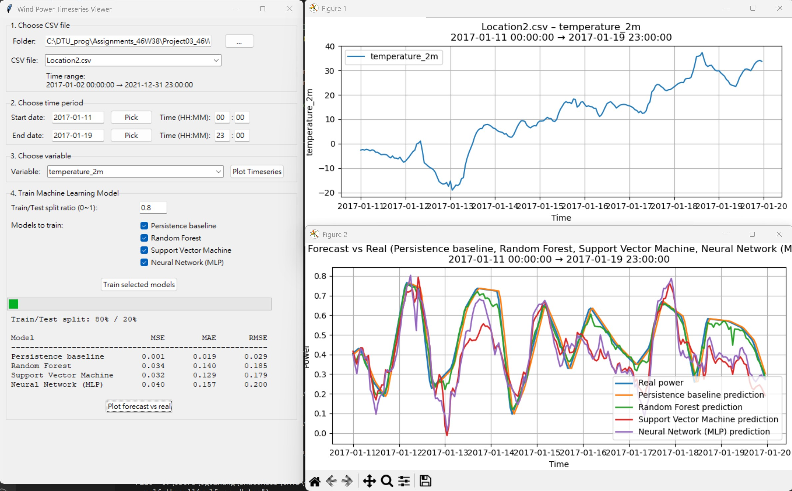
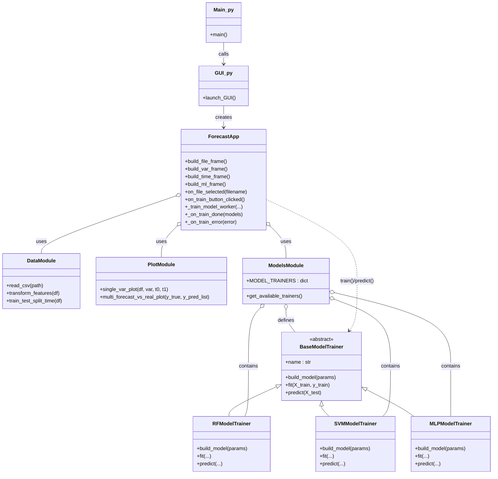
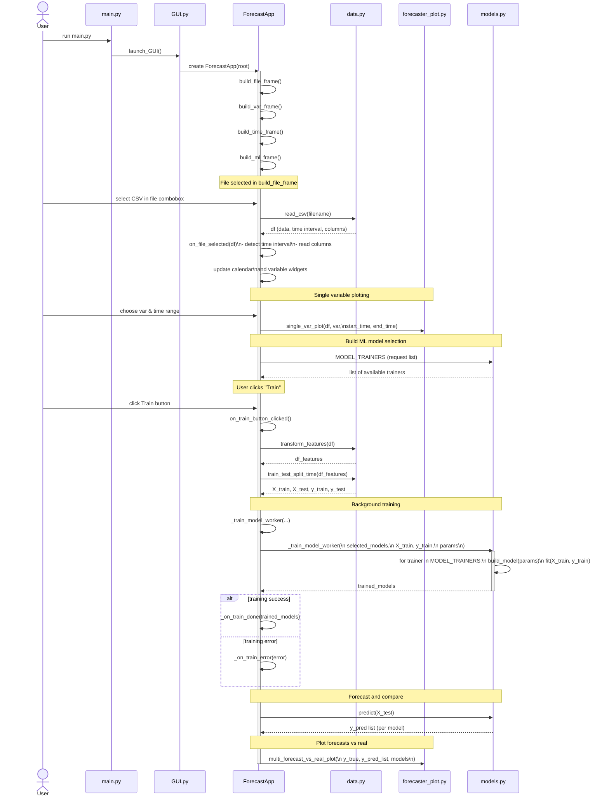

# Wind Power Forecasting with Machine Learning (Project03 in 46W38)



This project implements a modular, GUI visualized, reusable Python package for machine-learning forecasting.  
It includes:
* data loading utilities
* multiple machine-learning forecasting models
* plotting functions
* a graphical user interface (GUI)
* a complete example workflow for evaluation  

This project reads the datasets supplied for Project03, processes the time-series data, and provides a GUI-based environment that runs fixed machine learning forecasting models, while keeping the code structure extensible for future model additions.  

## Linux (Ubuntu) extra dependency  

This project uses `tkinter` for the GUI. On many Ubuntu systems,
`tkinter` is not installed by default.

Before installing this package, please run:

```bash
sudo apt-get update
sudo apt-get install -y python3-tk
```

## Project Structure

```
Project03_46W38_MLforecasting
 ┣ examples
 ┣ inputs
 ┃ ┣ Location1.csv
 ┃ ┣ Location2.csv
 ┃ ┣ Location3.csv
 ┃ ┣ Location4.csv
 ┃ ┗ readme.txt
 ┣ outputs
 ┣ src
 ┃ ┗ windpower_forecast
 ┃ ┃ ┣ __pycache__
 ┃ ┃ ┃ ┣ data.cpython-313.pyc
 ┃ ┃ ┃ ┣ forecaster.cpython-313.pyc
 ┃ ┃ ┃ ┣ forecaster_io.cpython-313.pyc
 ┃ ┃ ┃ ┣ forecaster_plot.cpython-313.pyc
 ┃ ┃ ┃ ┣ GUI.cpython-313.pyc
 ┃ ┃ ┃ ┣ metrics.cpython-313.pyc
 ┃ ┃ ┃ ┣ models.cpython-313.pyc
 ┃ ┃ ┃ ┗ __init__.cpython-313.pyc
 ┃ ┃ ┣ data.py
 ┃ ┃ ┣ forecaster_plot.py
 ┃ ┃ ┣ GUI.py
 ┃ ┃ ┣ models.py
 ┃ ┃ ┣ tempCodeRunnerFile.py
 ┃ ┃ ┗ __init__.py
 ┣ tests
 ┣ .git
 ┣ .gitignore
 ┣ LICENSE
 ┣ main.py
 ┗ README.md
```  
`inputs/` contains the provided CSV datasets.  
`src/windpower_forecast/` contains the entire package implementation.

---

## Package Overview

The `windpower_forecast` package provides tools for:

**Data Processing**  

* Time-based splitting of datasets for training and testing in time-series forecasting
* Vectorization of wind direction and generation of time-related features

**Forecasting Models**  

Implemented inside `models.py`:

* Baseline / naïve model
* Support Vector Regression (SVR)
* Random Forest Regressor
* Other scikit-learn based regressors
* Standardized interface for training & prediction

**Plotting**  

Implemented inside `forecaster_plot.py`:

* forecast vs real curves
* multiple-model comparison in a single figure
* configurable titles, legends, and time axes

**GUI Tool (optional feature)**  

Implemented in `GUI.py`:

* Tkinter-based front-end
* Choose CSV file from `inputs/`
* Select date ranges
* Select train/test split index
* Train several ML models at once
* Visualize output in matplotlib

---

## Architecture Diagram 




**Explanation of relationships**

| Module                 | Purpose                                  |
| ---------------------- | ---------------------------------------- |
| **data.py**            | Centralized CSV loading & preprocessing  |
| **models.py**          | ML model classes: training, predicting   |
| **forecaster_plot.py** | Visualization utilities                  |
| **GUI.py**             | User interface that connects all modules |
| **main.py**            | Example workflow demonstrating usage     |

---

## Class Implementations

The project contains multiple classes (requirement satisfied). Key classes include:

* * *

**`class BaseModelTrainer`**

*File:* `models.py`

Defines the standard interface for all forecasting models.

**Main methods**

* `fit(X, y)`
* `predict(X)`
* `evaluate(y_true, y_pred)`

* * *

**`class SVRForecaster(BaseModel)`**

*File:* `models.py`

Implements a Support Vector Regression model for time-series forecasting.

* * *

**`class RandomForestForecaster(BaseModel)`**

*File:* `models.py`

Implements a Random Forest model suitable for nonlinear forecasting.

* * *

**GUI Class — `class ForecastGUI`**

*File:* `GUI.py`

Encapsulates the Tkinter graphical interface.

Features:

* file selector
* date/time range preview
* train/test split
* buttons to train models and visualize results
* auto-plotting of forecast outputs

## How to Run (Evaluation Script)

Your evaluation entry point is **main.py** located at project root.

### Run the main example:

```bash
python main.py
```

This script demonstrates:

* loading a CSV dataset
* preparing train/test split
* training one or more forecasting models
* plotting forecast vs real curves
* saving results into `outputs/`

Runtime is well under the required **10 minutes**.

---

## Tests

Tests function wasn't implemented.

---
## Dependencies

````markdown
This project requires the following third-party Python libraries:

- numpy
- pandas
- scikit-learn
- matplotlib
- tkcalendar

`tkinter` is part of the Python standard library but must be installed on your system (especially on macOS).

Install all dependencies:

```bash
pip install -r requirements.txt
````

---

# License

MIT License.

---

# Summary

This project delivers a full wind-power time-series forecasting pipeline, including:

* reusable Python package
* modular architecture
* GUI and CLI usage
* ~~clear~~ class organization
* example script for evaluation

---

# Scope

* Provide GUI access to machine learning parameters used during model training
* Analyze and compare the contribution of each feature column to the forecasting results