# **Project 03 — Wind Power Forecasting with Machine Learning**  
Chang, Chihyang (s237232)

---

# **1. Introduction**

This project implements a modular machine-learning pipeline for forecasting wind power from time-series measurement data. The system includes data loading, feature engineering, model training, and forecast evaluation. A lightweight GUI triggers the workflow, but the main focus is the ML pipeline and software modularity.

---

# **2. System Architecture**

Core modules (in `src/windpower_forecast/`):

| Module               | Purpose                                      |
| -------------------- | -------------------------------------------- |
| `forecaster_io.py`   | CSV loading                                  |
| `data.py`            | Feature engineering and time-based splitting |
| `models.py`          | ML model registry and trainer classes        |
| `forecaster_plot.py` | Plotting utilities                           |
| `GUI.py`             | Optional user interface                      |

---

## **2.1 ML Pipeline Overview**



```
Raw CSV
 → transform_features()
 → train_test_split_time()
 → model.fit()
 → model.predict()
 → forecast_vs_real_plot()
```

The design ensures correct temporal handling and easy extensibility of models.

---

# **3. Implementation**

## **3.1 Feature Engineering**

`transform_features()` prepares the dataset:

* Wind direction encoded with `sin(dir)` and `cos(dir)`
* Optional time indicators (hour, etc.)
* Numerical columns standardized if required

This avoids angular discontinuity and improves model performance.

---

## **3.2 Time-Based Train/Test Split**

A chronological split prevents leakage:

```python
train = df.iloc[:split_idx]
test  = df.iloc[split_idx:]
```

This reflects realistic forecasting conditions.

---

## **3.3 Model Training Framework**

Models inherit from:

```
BaseModelTrainer
   ├─ RandomForestTrainer
   ├─ SVRTrainer
   └─ MLPRegressorTrainer
```

They are registered in:

```
MODEL_TRAINERS = { "RandomForest": ..., "SVR": ..., "MLP": ... }
```

Training runs in background threads but all logic resides in the model classes, not in the GUI.

---

## **3.4 Forecast Evaluation**

Predictions on the test set are passed to:

```
multi_forecast_vs_real_plot()
```

producing a combined plot of true power and model forecasts for comparison.

---

# **4. Results**


Performance metrics:

| Model        | MSE | MAE | RMSE |
| ------------ | --- | --- | ---- |
| RandomForest | …   | …   | …    |
| SVR          | …   | …   | …    |
| MLP          | …   | …   | …    |

Tree- and kernel-based models generally provide stable results with minimal tuning.

---

# **5. Discussion**

Wind-direction vectorization and chronological splitting have strong positive effects on accuracy. RandomForest and SVR produce reliable forecasts under limited feature engineering, while MLP is more sensitive to scaling and hyperparameters.
The modular design simplifies future extensions (new models, new features, or external predictors).

---

# **6. Conclusion**

The project demonstrates a clear, modular ML forecasting workflow for wind power. The GUI serves only as an interaction layer, while the core contribution lies in the design of the data pipeline, model training structure, and forecast evaluation. The system is extensible and aligned with the goals of the 46W38 Scientific Programming course.

---